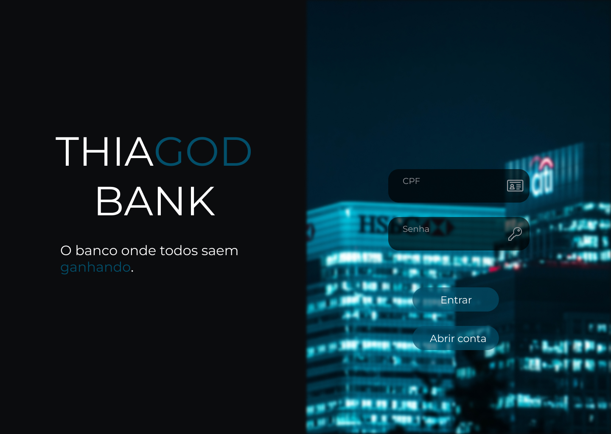

# THIAGOD BANK - FRONTEND

- Esse repositório representa a parte visual de um projeto pessoal com temática de um banco digital feito por mim

- A tecnologia utilizada para desenvolver as telas foi o React

- Para executar esse projeto em sua máquina, você deve executar os seguintes passos: 
  
  1 -  Abra um terminal e navegue até a pasta do projeto.
  
  2 - Na pasta do projeto, digite o seguinte comando em seu terminal: <br/> 
      ```
        npm install 
      ```
      <br/>
      
  3 - Em seguida, execute o comando: 
    ```
      npm start
    ```
    
  4 - Ao finalizar o processo, você deve visualizar em seu navegador a seguinte página: 
  
  
